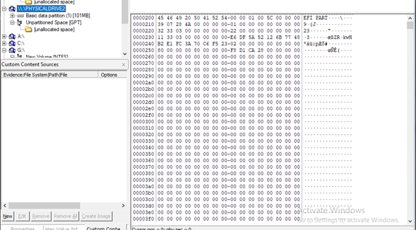
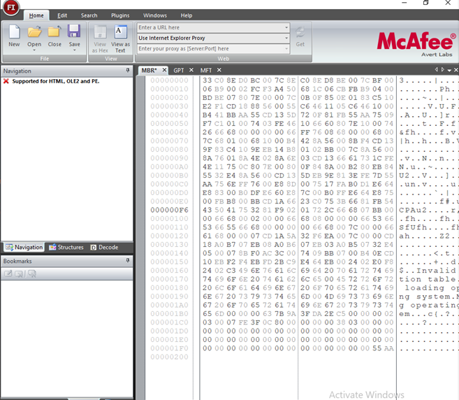

# MBR GPT

# Анализ служебных структур MBR GPT и главной файловой таблицы MFT

Анализ произведен при помощи приложения FTKImager и FileInsight.

FTKImager – приложение для создания образов в операционной системе
Windows.

FileInsight – программа, разработанная специально для специалистов по
безопасности, и призванная помочь в анализе файлов. С ее помощью можно
увидеть внутреннюю структуру исполняемого файла, проанализировать его,
найти уязвимости и определить метод распространения вредоносного кода.

## Подготовим данные для анализа.

Для начала необходимо создать новые виртуальные диски. При создании
разметок логических дисков для одного используем MBR, для второго GPT.

Начинаем работать с программой FTK Imager. Сначала необходимо запустить
программу от имени администратора.

MBR разметка:

GPT разметка:

Файл $MFT:

Файлы для анализа:

## Выделение основных структур загрузочных записей

### MBR

Открываем эти файлы в приложении FileInsight и начинаем анализ.

Проведем анализ структуры MBR. Фиолетовым выделим загрузочный код.
Запись таблицы разделов №1 выделим отдельно. Коричневым – запись таблицы
2. Далее следуют записи таблицы 3 и 4 соответственно. Желтым выделим
сигнатуру окончания загрузочной записи.

00 – Флаг загрузочного отдела

02 03 00 – Начальный CHS адрес раздела

07 – Тип файловой системы (NTFS)

FE 3F 0C – Конечный CHS адрес раздела

80 00 00 00 – Начальный LBA адрес раздела

00 38 03 00 – Размер раздела в секторах

### GPT

### MFT
