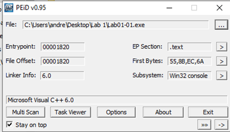
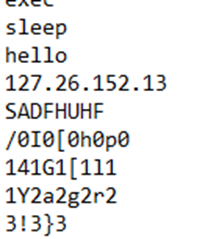

# Malware + VT

# Статический анализ вредоносных программ

Были получены 4 подозрительных приложения, которые необходимо
проанализировать и понять какую полезную нагрузку они могут в себя
включать. Также в ходе работы будет затронута служба VirusTotal.

VirusTotal — бесплатная служба, осуществляющая анализ подозрительных
файлов и ссылок (URL) на предмет выявления вирусов, червей, троянов и
всевозможных вредоносных программ.

## Анализ программ

### Lab01-01.exe и Lab01-01.dll

По отчету с VirusTotal можно утверждать, что данные программы несут в
себе полезную нагрузку, которая может угрожать устройству.

Чтобы посмотреть даты компиляции программ можно использовать утилиту
PEview. Для этого необходимо посмотреть значение поля TimeDateStamp в
файловом заголовке IMAGE_FILE_HEADER.

С использованием утилиты PEiD выполним сканирование исполняемых файлов.
Утилита PEiD обнаружила сигнатуру стандартного компилятора фирмы
Microsoft, что говорит об отсутствии изменений возле точки входа в
программу.

Затем можно проверить поля размеров секции в памяти и на диске. Размеры
секции кода на диске и в памяти практически одинаковые, что также
говорит об отсутствии следов обфускации.

Следующим шагом может стать проверка строк с исполняемых файлах. Для
этого можно воспользоваться утилитой strings из пакета Malcode Analyst
Pack. Строки в исполняемых файлах присутствуют в явном виде, что говорит
об отсутствии следов обфускации или упаковки.

Для анализа исполняемых функций можно воспользоваться утилитой
Dependency Walker. Она показывает все используемые библиотеки и
импортируемые из них функции. В первом файле присутствуют функции
CopyFile, FindFirstFile, FindNextFile. Это говорит о том, что скорее
всего программа ищет какой-то файл и затем копирует его. Во втором файле
находятся функции CreateProcess, Sleep. Основываясь на этом, можно
сделать вывод, что исследуемая DLL, скорее всего создаст новый процесс и
на каком-то этапе заснет (приостановит выполнение). В DLL также
присутствуют интересные импортируемые функции из библиотеки WS2_32.DLL,
которые импортируются по порядковому номеру. К интересным функциям из
библиотеки WS2_32.DLL можно отнести: closesocket, connect, htons,
inet_addr, recv, send, shutdown, socket, WSAStartup, WSACleanup. Эти
функции говорят о том, что программа выполняет интернет соединение и
передает данные на удаленный IP-адрес.

Внимательное изучение строк, содержащихся в файле Lab01-01.exe,
показывает, что он ссылается на файл с именем
C:\windows\system32\kerne132.dll. В записи присутствует очень тонкая
ошибка. Вместо латинской буквы l используется 1, из-за этого, вероятно,
это программа является вредоносной, и можем использовать ее для поиска
зараженных систем.

Внимательное изучение строк, содержащихся в библиотеки Lab01-01.dll,
отражает IP-адрес. С учетом импортируемых сетевых функций можно
предположить, что файл связывается с этим IP-адресом. Этот признак можно
использовать для поиска зараженных систем, которые связались с
IP-адресом 127.26.152.13.

На основе проведенного анализа можно предположить, что исполняемый файл
Lab01-01.exe используется для запуска библиотеки DLL (Lab01-01.dll),
которая действует как бэкдор или троянская программа удаленного доступа
(RAT). На основе импорта можно сказать, что исполняемый файл ищет,
существует ли C:\windows\system32\kerne132.dll, если ее нет, то он может
попытаться скопировать вредоносную DLL в
C:\windows\system32\kerne132.dll, которая используется для закрепления в
системе. После запуска, DLL (Lab01-01.dll), вероятно, связывается с
C2-сервером по адресу 127.26.152.13.

### Lab01-02.exe

### Lab01-03.exe

### Lab01-04.exe
