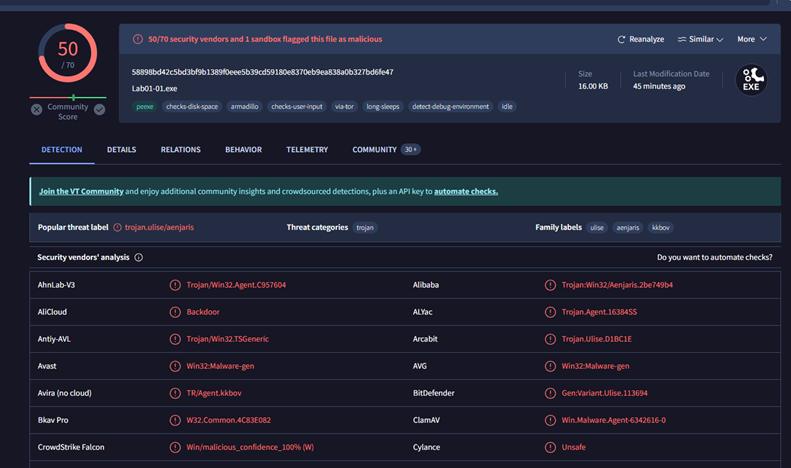
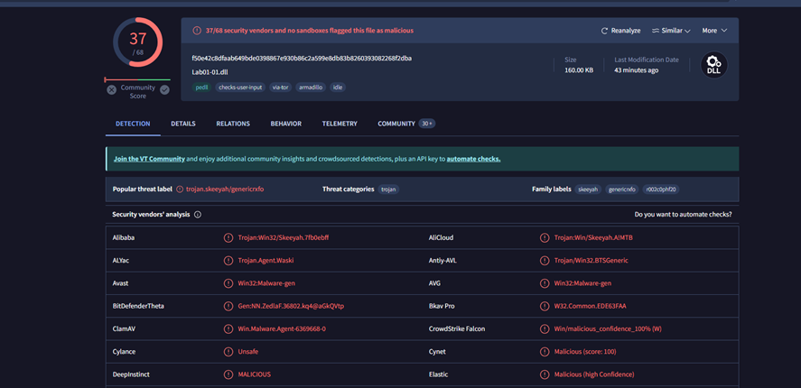
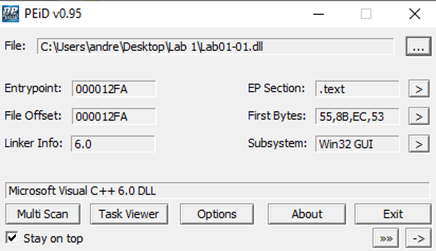
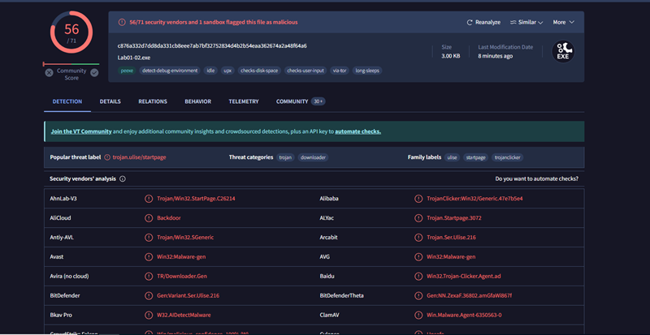
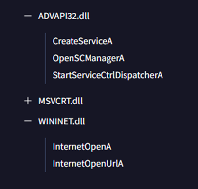
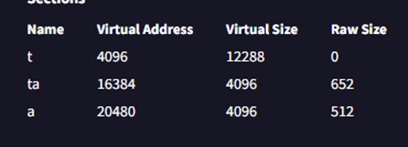
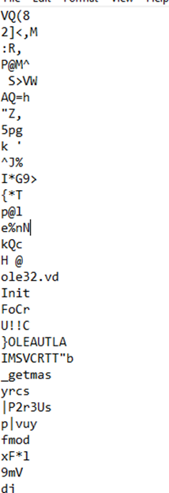
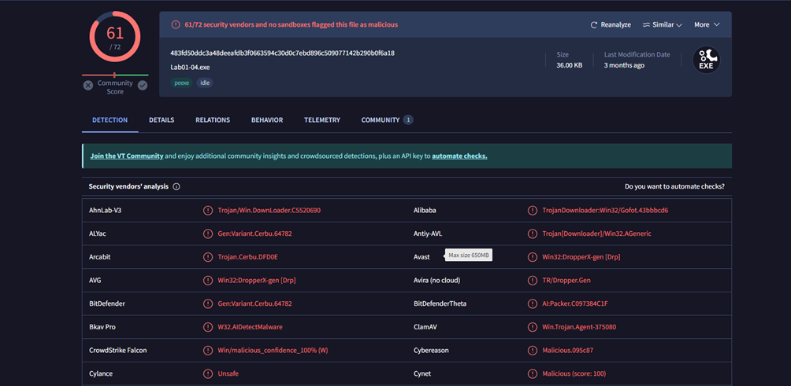
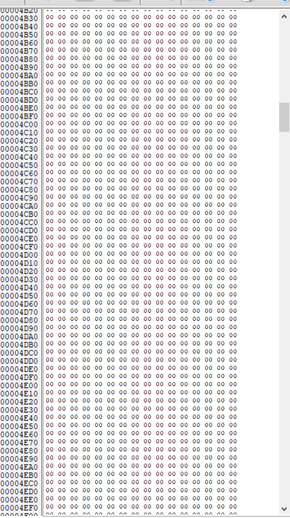

# Malware + VT

# Статический анализ вредоносных программ

Были получены 4 подозрительных приложения, которые необходимо
проанализировать и понять какую полезную нагрузку они могут в себя
включать. Также в ходе работы будет затронута служба VirusTotal.

VirusTotal — бесплатная служба, осуществляющая анализ подозрительных
файлов и ссылок (URL) на предмет выявления вирусов, червей, троянов и
всевозможных вредоносных программ.

## Анализ программ

### Lab01-01.exe и Lab01-01.dll

По отчету с VirusTotal можно утверждать, что данные программы несут в
себе полезную нагрузку, которая может угрожать устройству.

Чтобы посмотреть даты компиляции программ можно использовать утилиту
PEview. Для этого необходимо посмотреть значение поля TimeDateStamp в
файловом заголовке IMAGE_FILE_HEADER.

С использованием утилиты PEiD выполним сканирование исполняемых файлов.
Утилита PEiD обнаружила сигнатуру стандартного компилятора фирмы
Microsoft, что говорит об отсутствии изменений возле точки входа в
программу.

Затем можно проверить поля размеров секции в памяти и на диске. Размеры
секции кода на диске и в памяти практически одинаковые, что также
говорит об отсутствии следов обфускации.

Следующим шагом может стать проверка строк с исполняемых файлах. Для
этого можно воспользоваться утилитой strings из пакета Malcode Analyst
Pack. Строки в исполняемых файлах присутствуют в явном виде, что говорит
об отсутствии следов обфускации или упаковки.

Для анализа исполняемых функций можно воспользоваться утилитой
Dependency Walker. Она показывает все используемые библиотеки и
импортируемые из них функции. В первом файле присутствуют функции
CopyFile, FindFirstFile, FindNextFile. Это говорит о том, что скорее
всего программа ищет какой-то файл и затем копирует его. Во втором файле
находятся функции CreateProcess, Sleep. Основываясь на этом, можно
сделать вывод, что исследуемая DLL, скорее всего создаст новый процесс и
на каком-то этапе заснет (приостановит выполнение). В DLL также
присутствуют интересные импортируемые функции из библиотеки WS2_32.DLL,
которые импортируются по порядковому номеру. К интересным функциям из
библиотеки WS2_32.DLL можно отнести: closesocket, connect, htons,
inet_addr, recv, send, shutdown, socket, WSAStartup, WSACleanup. Эти
функции говорят о том, что программа выполняет интернет соединение и
передает данные на удаленный IP-адрес.

Внимательное изучение строк, содержащихся в файле Lab01-01.exe,
показывает, что он ссылается на файл с именем
C:\windows\system32\kerne132.dll. В записи присутствует очень тонкая
ошибка. Вместо латинской буквы l используется 1, из-за этого, вероятно,
это программа является вредоносной, и можем использовать ее для поиска
зараженных систем.

Внимательное изучение строк, содержащихся в библиотеки Lab01-01.dll,
отражает IP-адрес. С учетом импортируемых сетевых функций можно
предположить, что файл связывается с этим IP-адресом. Этот признак можно
использовать для поиска зараженных систем, которые связались с
IP-адресом 127.26.152.13.

На основе проведенного анализа можно предположить, что исполняемый файл
Lab01-01.exe используется для запуска библиотеки DLL (Lab01-01.dll),
которая действует как бэкдор или троянская программа удаленного доступа
(RAT). На основе импорта можно сказать, что исполняемый файл ищет,
существует ли C:\windows\system32\kerne132.dll, если ее нет, то он может
попытаться скопировать вредоносную DLL в
C:\windows\system32\kerne132.dll, которая используется для закрепления в
системе. После запуска, DLL (Lab01-01.dll), вероятно, связывается с
C2-сервером по адресу 127.26.152.13.

### Lab01-02.exe

По отчету с VirusTotal можно утверждать, что данные программы несут в
себе полезную нагрузку, которая может угрожать устройству.

Зайдем в отчет VirusTotal, по его данным можно утверждать, что файл
упакован, причем также можно определить, чем файл был упакован(UPX).

Также можно заметить, что виртуальный размер сильно не совпадает с
физическим.

Распакуем файл.

Посмотрим уже распакованный файл в VirusTotal, можно выделить интересные
функции. На основании этого мы можем сделать вывод, что исполняемый файл
создает и запускает службу и что он подключается к Интернету.

При просмотре файла можно заметить службу, про которую мы узнали на
прошлом шаге и ссылку. Исходя из этого, мы можем предположить, что поиск
хостов для запланированной службы под названием ‘malservice” и просмотр
любых хостов, подключенных к “http://www.malwareanalysisbook.com’,
послужат надежными индикаторами хоста и сети.

### Lab01-03.exe

По отчету с VirusTotal можно утверждать, что данные программы несут в
себе полезную нагрузку, которая может угрожать устройству.

Зайдем в отчет VirusTotal, по его данным можно утверждать, что файл
упакован, причем также можно определить, чем файл был упакован (FSG).

При анализе нашлась аномалия, для разделов нет таблиц импорта, хотя
исходя из dependency Walker можно утверждать, что библиотеки
импортируются. Наличие данных библиотек может свидетельствовать о том
что файл упакован.

Также сильная разница в размерах занимаемой памяти может
свидетельствовать, что файл упакован.

Импортируемые функции могут показать, что файл упакован. Из-за того, что
мы не можем его распаковать, не представляется возможным дальнейший
анализ библиотек и их функций.

Из-за того, что мы не можем распаковать файл, не представляется
возможным дальнейший анализ сетевых признаков. Любые данные являются
наборов данных, которые не возможно проанализировать.

### Lab01-04.exe

По отчету с VirusTotal можно утверждать, что данные программы несут в
себе полезную нагрузку, которая может угрожать устройству.

Нет никаких признаков, что данный файл был запакован или обфксцирован.
Размеры данных в памяти совпадают. Упаковщик определяется как
стандартный Microsoft Visual C ++ 6.0. Также dependency walker спокойно
определяет количество импортируемых библиотек.

При помощи PEview мы видим, что дата компиляции у программы является
2025 год, что на момент написания отчета является будущим.

На основе импорта из Kernel32 мы можем видеть, что это загрузит ресурсы
из раздела ресурсов файла и запишет файлы на диск. Основываясь на
функции GetWindowsDirectory, мы можем предположить, что это запишет
файлы в системный каталог, а затем выполнит их благодаря функции WinExec

Просмотрев строки файла можно найти записи для winup.exe и wupdmgrd.exe,
также найти адрес, с которого скорее всего происходит установка полезной
нагрузки или обновления данной троянской программы.

Открывает данный файл при помощи утилиты Resource Hacker и замечаем, что
в заголовке зашит встроенный исполняемый файл.

Также можно обратить внимание, что файл содержит очень большое
количество нулевых записей.

Сохраняем файл как двоичный файл и используем dependency walker и видим,
что файл содержит функцию kernel32 и функции WinExec, URLDownloadToFile,
которые указывает, что скорее всего приложение скачивает файл с
удаленного ресурса и запускает её.

