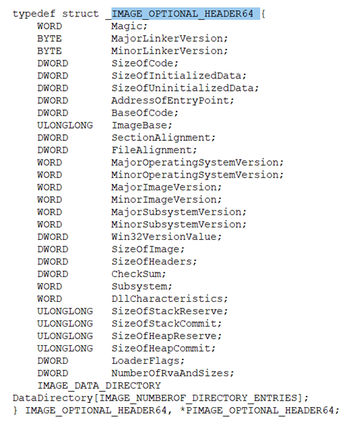
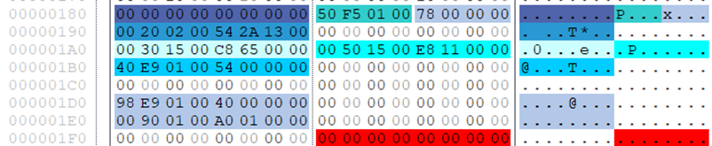
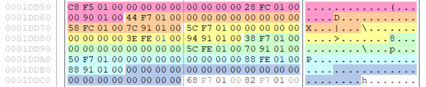

# Volatility Framework

# Анализ служебных структур исполняемых файлов формата PE

## Подготовка программ для анализа

Возьмем актуальный Chrome установщик

Для более приятной работы с будущим анализом и выявлением ресурсов и
перемещаемых элементов создадим небольшое приложение в Visual Studio
2022.

Начинаем работать с программой FileInsight. Откроем исследуемые файлы в
данной программе.

Установщик:

Созданное приложение:

## Анализ

### Выявление основных полей заголовков исполняемого файла

Согласно спецификации исполняемый файл состоит из нескольких частей:

-   DOS – заголовок

-   DOS – заглушка

-   NT – заголовок

-   Заголовки секций

-   Секции

Для дальнейшего анализа DOS – заголовка необходимо определить его
структуру.

Всего у нас 19 полей в заголовке. Нам необходимо выделить из них только
2 основных. Нас интересуют 2 поля: e_magic и e_lfanew. Поле e_magic
содержит двухбайтовое значение 0х4D5A, что в кодировке ASCII
соответствует буквам MZ. Данные буквы являются своего рода
«опознавательной» сигнатурой, которые указывают, что файл является
исполняемым форматом для операционной системы Windows. Поле e_lfanew
содержит смещение, которое указывает на начало основного заголовка
исполняемого файла – NT-заголовка.

Поле e_lfanew содержит смещение 264 байт. Отсчитываем данный промежуток
и переходим к началу NT-заголовка.

Для дальнейшего анализа NT – заголовка необходимо определить его
структуру.

В свою очередь IMAGE_FILE_HEADER и IMAGE_OPTIONAL_HEADER имеют свою
вложенную структуру.

Проведем анализ структуры NT-заголовка. Выделяем структуру Signature и
File Header.

-   Signature - Первая часть NT-заголовка, является указателем на его
    начало и представляет собой сигнатуру, которая должна быть равна
    значению 0х50450000, что в кодировке ASCII соответствует символам
    «РЕ00».

-   File Header - Файловый заголовок содержит множество полей, некоторые
    из которых являются важнейшими, и без них исполняемый файл просто не
    будет работать.

-   Поле Machine определяет тип центрального процессора, для которого
    предназначен файл. (0x014С – Intel 386)

-   Поле NumberOfSection определяет количество секций в исполняемом
    файле. (5)

-   Поле TimeDateStamp содержит время создания исполняемого файла,
    компоновщиком. Представлено по стандарту POSIX(UNIX).

-   Поле Characteristics содержит флаги, которые определяют атрибуты
    исполняемого файла. (0x0102 - Индикатор о том, что файл проверен
    (валидный) и может быть запущен и Индикатор, соответствует тому, что
    исполняемый файл является 32-х разрядным.

Третьим компонентом NT-заголовка является «опциональный» заголовок –
Optional Header.

1\. Поле Magic указывает разрядность исполняемого файла (PE32 или
PE32+). 0x010b – PE32

2\. Поле AddressOfEntryPoint содержит относительный виртуальный адрес
 (Relative Virtual Address, RVA), точки входа, с которого программа
начинает выполнение. (4F0E)

3\. Поля SizeOfCode и SizeOfInitializedData содержат суммарные размеры
программных секций и секций, инициализированных данных (не включая
сегменты программного кода), соответственно. (17400)

4\. Поле BaseOfCode содержит относительный виртуальный адрес (RVA),
секции кода при загрузке в память.  (4096)

5\. Поле BaseOfData содержит относительный виртуальный адрес (RVA),
секции данных при загрузке в память. (102400)

6\. Поле ImageBase содержит предпочтительный адрес загрузки исполняемого
файла в память. (400000)

7\. Поле SectionAlignment содержит значение выравнивания секции в байтах
при выгрузке в виртуальную память. Значение должно быть больше или
эквивалентно значению поля FileAlignment. (1000)

8\. Поле FileAlignment содержит значение выравнивания «сырых» данных
секции в байтах на диске. (200)

9\. Поле CheckSum содержит значение контрольной суммы всего образа
(исполняемого файла). (15EC6B)

10\. Поле Subsystem содержит сведения о подсистеме запуска исполняемого
файла. 00 02 (Приложения с графическим интерфейсом)

11\. Поле DllCharacteristics содержит флаги, которые определяют
дополнительные атрибуты исполняемого файла. (8140)

В конце опционального заголовка расположен массив структур типа
IMAGE_DATA_DIRECTORY.

Заголовки секций представляют собой массив данных типа
IMAGE_SECTION_HEADER, который описывает размещений секций в исполняемом
файле и, соответственно, в памяти после загрузки.  

1 Поле Name содержит массив символов, определяющих название секции.
(.text)

2 Поле PhysicalAddress|VirtualSize может иметь различное назначение в
зависимости от того, находится ли оно в объектном или же в исполняемом
файле. Для исполняемых файлов используется поле VirtualSize в котором
содержится размер секции (не выравненный). (17243)

3 Поле VirtualAddress содержит относительный виртуальный адрес загрузки
секции в память. Это смещение вычисляется относительно предпочтительного
адреса загрузки исполняемого файла (ImageBase). (1000)

4 Поле SizeOfRawData содержит размер секции, выравненный по значению
поля FileAlignment. (17400)

5 Поле PointerToRawData содержит адрес секции относительно начала
исполняемого файла. (400)

6 Поле Characteristics содержит флаги, которые определяют атрибуты
секции исполняемого файла. (60000020).

Аналогично поля будут для остальных заголовков секций: .rdata, .data,
.rsrc, .reloc.

Легко определить, где начинаются сами секции данных (PointerToRawData):

-   .text – 400

-   .rdata – 17800

-   .data – 1E800

-   .rsrc – 1F200

-   .reloc – 151E00

### Выявление заголовков импорта исполняемого файла

RVA=0x01F550

VA=0x019000

VA2=0x019000\<0x01F550

FA=0x017800

OFA=RVA-VA+FA=0x01F550-0x019000+0x017800=1DD50

Мы знаем, что заголовков должно быть 5, также что после последнего
должен следовать заголовок полностью из нулей. Выделим все эти
заголовки.

Для анализа заголовка импорта необходимо знать его структуру.

Определим имена данных библиотек (NAME):

-   1FC28-0x019000+0x017800=1E428

-   1FC58-0x019000+0x017800=1E458

-   1FE3E-0x019000+0x017800=1E63E

-   1FE5C-0x019000+0x017800=1E65C

-   1FE88-0x019000+0x017800=1E688

Определим расположение функций и их имена из каждой библиотеки:

-   1F5C8-0x019000+0x017800=1DDC8

-   1F744-0x019000+0x017800=1DF44

-   1F75C-0x019000+0x017800=1DF5C

-   1F738-0x019000+0x017800=1DF38

-   1F750-0x019000+0x017800=1DF50

Имена функций:

-   1F768 -0x019000+0x017800=1DF68

-   1FE48-0x019000+0x017800=1E648

-   1FC36-0x019000+0x017800=1E436

-   1FE7A-0x019000+0x017800=1E67A

-   1FE1A-0x019000+0x017800=1E61A

### Выявление ресурсов и перемещаемых элементов

Можно ознакомиться с заголовком секции .rsrc.

PointerToRawData – FC00

Секция ресурсов исполняемого файла не является обязательной и её наличие
может определяться желанием разработчика или функциональной
необходимостью, например, если исполняемый файл содержит графический
интерфейс.

Структура секции ресурсов

Структура IMAGE_RESOURCE_DIRECTORY содержит шесть полей, четыре из
которых в большинстве случаев заполнены нулями.

1\. Поле NumberOfNamedEntries указывает число ресурсов, идентифицируемых
по имени

2\. Поле NumberOfIdEntries указывает число ресурсов, идентифицируемых по
номеру

За заголовком следует строка ресурсов, представляющая собой структуру
IMAGE_RESOURCE_DIRECTORY_ENTRY.

Третий уровень иерархии ресурсов – подгруппа, в которой ресурсы
разделяются по языку. Всего уровней может быть 32, но в настоящее время
используются только три (тип, номер или имя, язык).

Следом за третьим уровнем иерархии ресурсов следует структура
IMAGE_RESOURCE_DATA_ENTRY, состоящая из четырех полей по четыре байта. В
большинстве случаев два последних поля заполнены нулями, а первые два
поля: OffsetToData и Size содержат относительный виртуальный адрес и
размер непосредственно самих ресурсов.

Поле NumberOfNamedEntries – 0

Поле NumberOfIdEntries – 1

Поле OffsetToData – 25170

Поле Size – 17D

.reloc

PointerToRawData – 10200

Секция перемещаемых элементов не является обязательной и используется
только когда загрузка по адресу, прописанному в поле ImageBase
опционального заголовка, оказывается невозможной. Тогда системный
загрузчик обращается к таблице перемещаемых элементов, представляющей
собой массив указателей на относительные виртуальные адреса, требующие
коррекции, и увеличивает их на разницу предполагаемого и фактического
адресов загрузки.

VirtualAddress – 1А000

SizeOfBlock – 20 (32)

Offset – 10
