# WireShark

# Анализ сетевого трафика с использованием WireShark

## Анализ дампа

Произведем первичный анализ дампа, посмотрев общую информацию о
доставшемся malware.pcap По данным из Wireshark определяем, что
временной период у дампа совсем не большой.

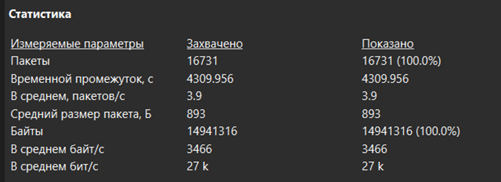

Попробуем открыть файл в VirusTotal. Он не смог найти в нем вредоносной
полезной нагрузки, но по сигнатуре смог определить, что данный pcap
содержит троян. Скорее всего это Trickbot. Также был обнаружен
исполняемый код.

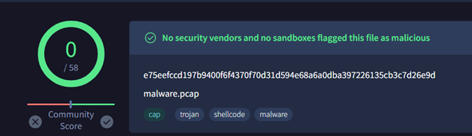

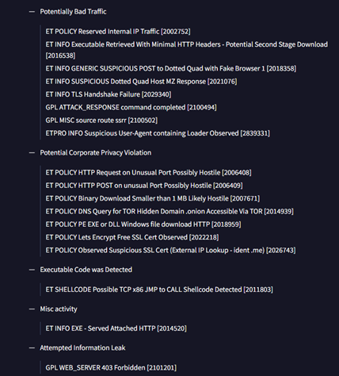

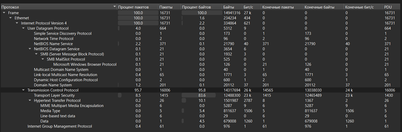

Большую часть пакетов (95.7%) были отправлены по протоколу TCP. Создаем
фильтр по TCP и начинаем изучать дамп. Немного посмотрев автор цепляется
своим взглядом за интересную активность от 10.9.25.101, который
проверяет доступ к различным внешним ip. Причем некоторые из данных
сервисов являются проверкой собственного ip.

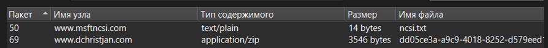

При попытке экспортировать данный файл из дампа ловим моментальное
предупреждение от Kaspersky. Он уверен, что это троянская программа и
удаляет её.

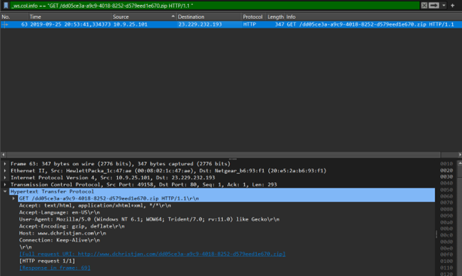

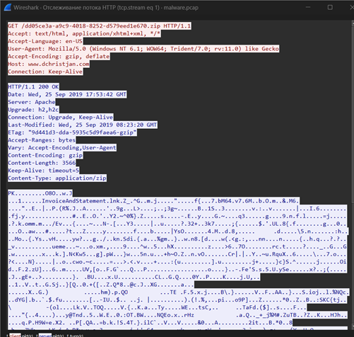

Обратимся к другим похожим запросам по фильтру http.request.method ==
“GET”.

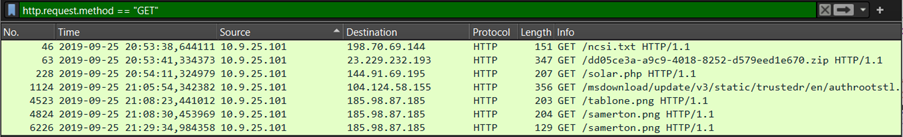

Замечаем подозрительный запрос solar.php. Если мы отследим поток TCP, то
окажется, что это исполняемый файл .exe, что показывается его названием
и начальными двумя байтами «MZ».

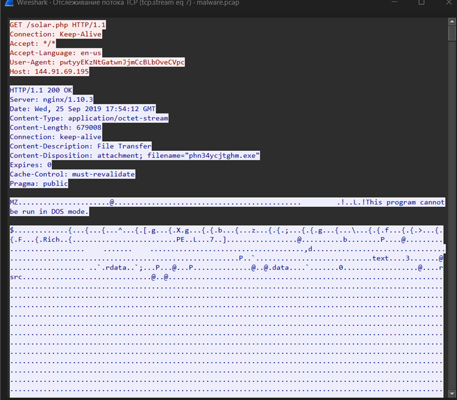

Попробуем отследить что делает данный троян в нашей системе. С нашего ip
идет генерация HTTP-трафика к 170.238.117.187.

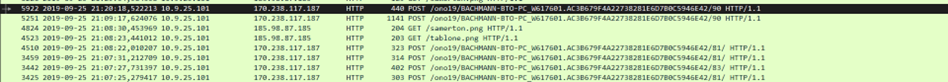

Проследив за
POST/ono19/BACHMANN-BTO-PC_W617601.AC3B679F4A22738281E6D7B0C5946E42/90
HTTP/1.1 мы обнаруживаем, что идет пересылка информации о системе:
Запущенные процессы, общая информация о системе, сетевая информация.

Общая информация о системе:

-   Host Name - BACHMANN-BTO-PC

-   OS Name - Microsoft Windows 7 Professional

-   OS Version - Service Pack 1

-   OS Architecture - 64-bit

-   Product Type - Workstation

-   Build Type - Multiprocessor Free

-   Registered Owner - admin

-   Registered Organization -

-   Serial Number - 00371-221-1925594-06178

-   Install Date - 30/12/1899 00.00.00

-   Last Boot Up Time - 30/12/1899 00.00.00

-   Windows Directory - C:\Windows

-   System Directory - C:\Windows\system32

-   Boot Device - \Device\HarddiskVolume1

-   Total Physical Memory - 2593 Mb

-   Available Physical Memory - 2593 Mb

Отправляются кэшированные данные паролей из веб-браузеров.

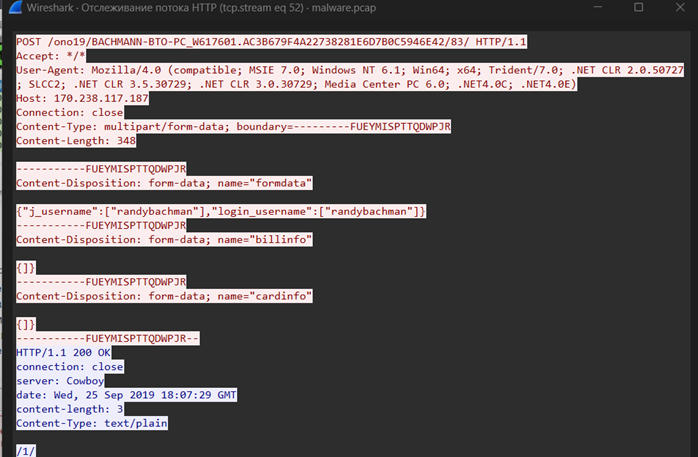

Можно сделать следующие выводы. Запросы заканчивающиеся на:

-   81 – Пароли из веб-браузеров

-   83 – Данные форм, отправленные приложениями

-   90 – Системная информация

Также в ходе изучения были замечены запросы Get с некими файлами,
заканчивающимися на .png. Изучив их мы понимаем, что это исполняемые
файлы, для дальнейшего заражения. После изучении работы Trickbot в сети
интернет, можно сделать вывод, что данные файлы необходимы для заражения
контроллера домена.

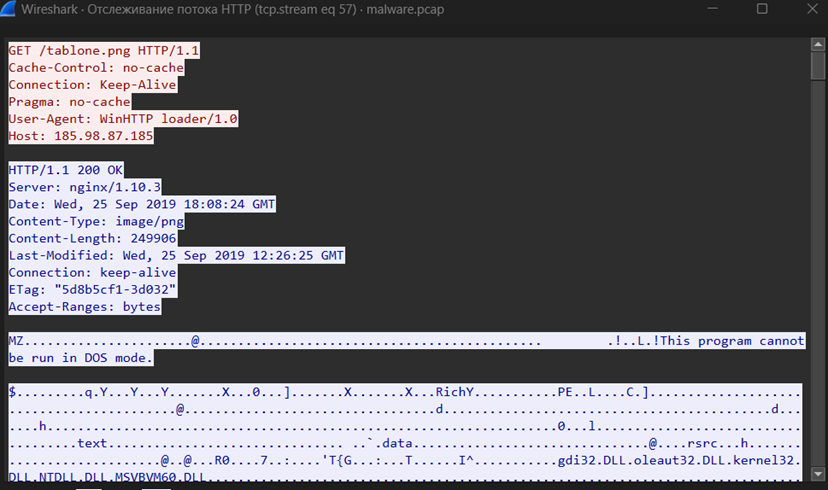

## Вывод

Был изучен дамп, который затрагивает время с 20:53:24-22:05:14
25-09-2019. В большей степени были использованы протоколы HTTP и TCP.
Общее количество пакетов – 16731, размером 14941316 байт. Зараженная
система располагается по ip 10.9.25.101 BACHMANN-BTO-PC (Microsoft
Windows 7 Professional). Аккаунт – admin. Пароль – P@ssw0rd$. Система
была заражена троянской программой Trickbot, который связывался с
внешними ресурсами для проверки ip зараженной системы, скидывал данные о
системе и пароли на свой сервер с ip 170.238.117.187. Скачивал полезную
нагрузку под видом файлов .png. В систему Trickbot попал при помощи
zip-архива, который содержит установщик, который ловит антивирус.
